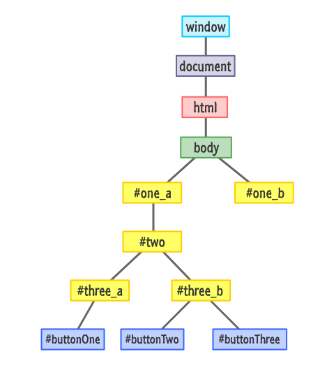

## Agenda 22.02.2021:

Javascript Events and Event Handling

- Event Registration
- Bubbling
- Capturing
- What is a threat?
- Thread Model in JavaScript
- Event Propagation
- How to control event Propagation
- Exercise

#### Resources:

[JavaScript Events Handling](https://www.slideshare.net/YuriyBezgachnyuk/js-events-40291436)

#### JavaScript:

```
<html>
    <body>
     <p id="parent">
        With <b id="child">Bubbling</b>, the event is first captured and handled by the innermost element and then propagated to outer elements.
        With capturing, the event is first captured by the outermost element and propagated to the inner elements.
     </p>
    </body>
<script>
 let parent=document.getElementById("parent"); // a reference to the parent id , i.e., the P tag
 let child = document.getElementById("child"); // a reference to the child id, i.e., the B tag

 parent.addEventListener("click",clickParent); // register an event handler to Click on Parent , by default(false ) we have the Bubbling mode
 child.addEventListener("click",clickChild);// to enable the capturing mode /true
    function clickParent(){

        console.log("I am the parent!");
    }
    function clickChild(e){
        console.log("I am the child!");
        e.stopPropagation();
    }
</script>
</html>
```

#### Exercises:

Exercise 1 : Bubbling & Capturing

Take a look DOM_index.png, and implement the following tasks:
1- Implement the associated HTML webpage
2- Register an event handler for ButtonOne
3- Enable Capturing on buttonOne
4- Explain what is the difference when you enable Capturing for the onclick even on buttonOne ?
5- Write a statement to stop the event propagation after executing the event handler for buttonOne
6- Enable Bubbling and explain what happens when you click on ButtonOne in this phase?


